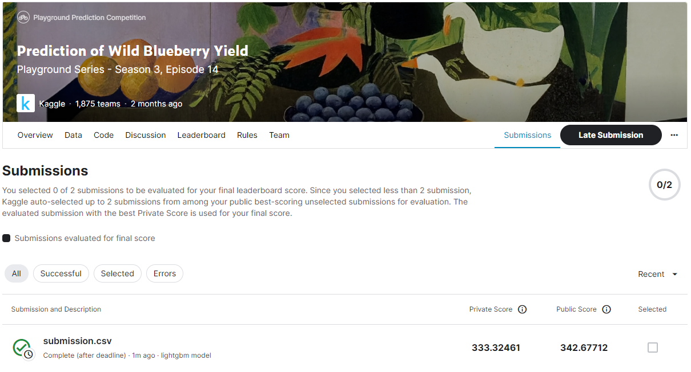
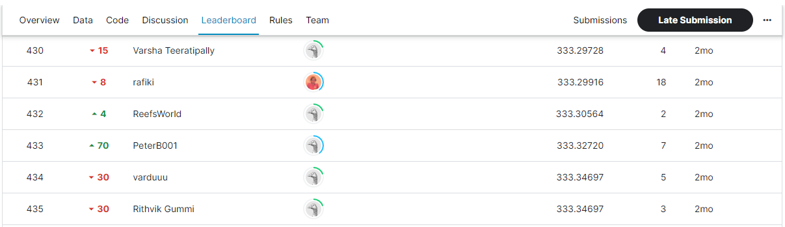

# Prediction of Wild Blueberry Yield
## 결과
### 요약 정보
- 도전기관 : SecuLayer
- 도전자 : 김소영
- 최종 스코어 : 333.32461
- 제출 일자 : 2023-07-04
- 총 참여 팀수 : 1,875
- 순위 및 비율 : 433 (23.1%)

## 결과 화면

## 사용한 방법 & 알고리즘
- Step 1. 데이터 전처리
  - 이상치 제거, Feature Engineering, PCA 변수, StandardScaler
- Step 2. LightGBM

## 코드
- Prediction_of_Wild_Blueberry_Yield.ipynb
