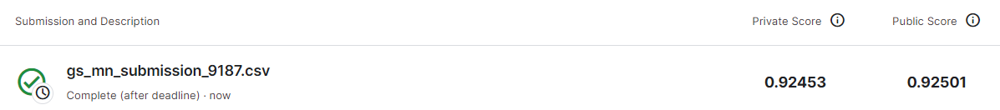
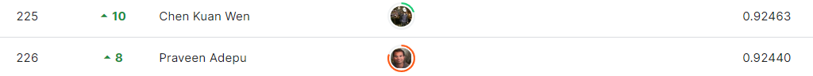

# Quick, Draw! Doodle Recognition Challenge
***
# 결과
***
## 요약정보
- 도전기관 : 시큐레이어
- 도전자 : 석민재
- 최종 스코어 : 0.92453
- 제출 일자 : 2023-07-17
- 총 참여 팀수 : 1309
- 순위 및 비율 : 226(17.26%)

# 결과 화면

# 사용한 방법 & 알고리즘
***
- ResNet의 발전 모델인 DenseNet121 모델 사용
- 이미지의 획 정보를 csv 파일로 저장하여 모델에 사용함으로써 저장 공간 절약 및 학습 시간 단축

# 코드
[DenseNet](./densenet_121.ipynb)

# 참고자료
- https://github.com/liuzhuang13/DenseNet
- https://github.com/benhamner/Metrics/blob/master/Python/ml_metrics/average_precision.py
