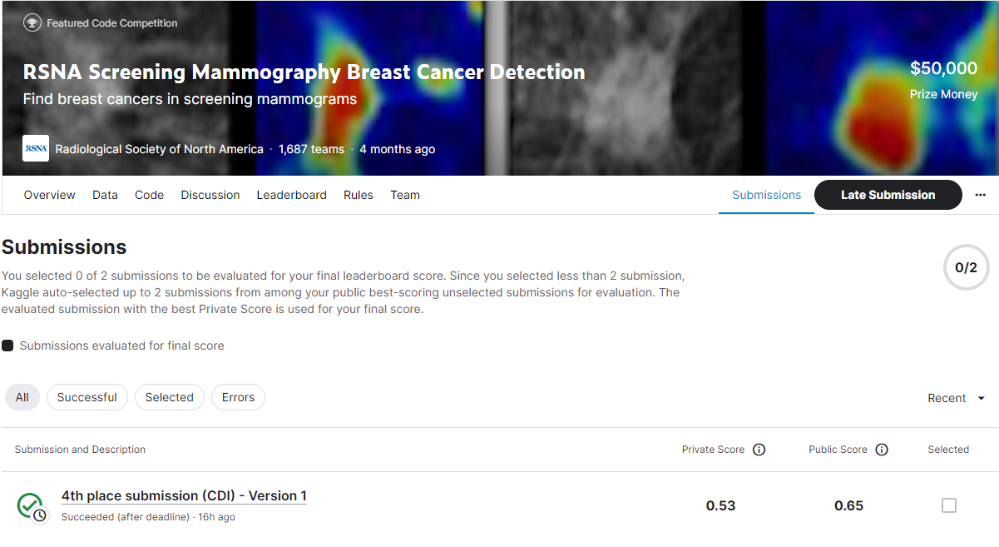
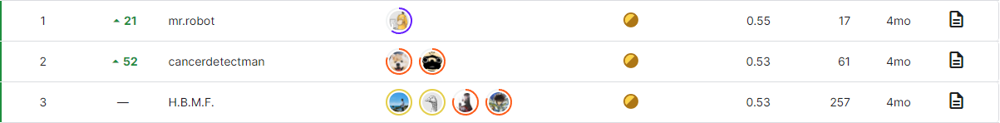

# rsna-breast-cancer-detection

---

# 결과

---

### 요약 정보

* 도전기관 : 시큐레이어
* 도전자 : 이준영
* 최종 스코어 : 0.53
* 제출 일자 : 2023-06-29
* 총 참여 팀수 : 1687
* 순위 및 비율 : 2(0.12%)

# 결과 화면

# 사용한 방법 & 알고리즘

---

* timm
* albumentations, ev2, PIL
* dicomsd1, pydicom

# 코드
[rsna-breast-cancer-detection](./4th-place-submission-cdi.ipynb)

# 참고자료