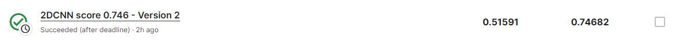

# RSNA-MICCAI Brain Tumor Radiogenomic Classification

---

# 결과

---

### 요약 정보

* 도전기관 : 시큐레이어
* 도전자 : 장석주
* 최종 스코어 : 0.51591
* 제출 일자 : 2023-06-28
* 총 참여 팀수 : 1555
* 순위 및 비율 : 931(59.9%)

# 결과 화면

# 사용한 방법 & 알고리즘

---

* Batch Normalization
* CNN Model

# 코드

[RSNA-MICCAI Brain Tumor Radiogenomic Classification - CNN](./rsna-miccai-brain-cnn.ipynb)

# 참고자료
