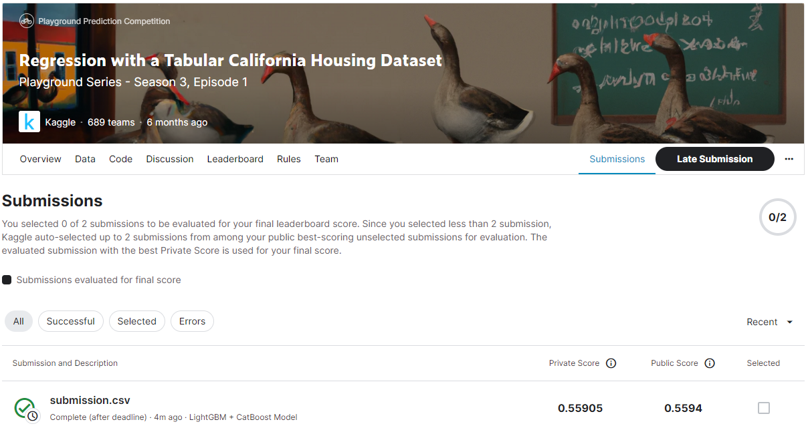
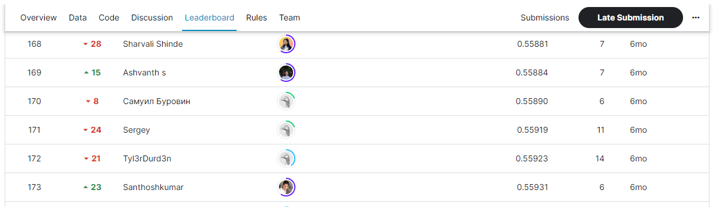

# Regression with a Tabular California Housing Dataset
## 결과
### 요약 정보
- 도전기관 : SecuLayer
- 도전자 : 김소영
- 최종 스코어 : 0.55905
- 제출 일자 : 2023-07-07
- 총 참여 팀수 : 689
- 순위 및 비율 : 171(24.8%)

## 결과 화면

## 사용한 방법 & 알고리즘
- Step 1. 데이터 전처리
- Step 2. Train LightGBM, CatBoost Model
- Step 3. Blending + Rounding

## 코드
- Regression_with_a_Tabular_California_Housing_Dataset.ipynb