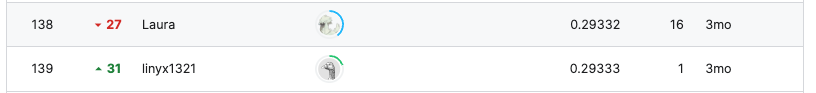

# Regression with a Tabular Media Campaign Cost Dataset

## 요약 정보
* 도전기관 : 시큐레이어
* 도전자 : 이정환
* 최종 스코어 : 0.29333
* 제출 일자 : 2023-06-22
* 총 참여 팀수 : 952
* 순위 및 비율 : 139 (14.6%)
___
## 결과 화면

___
## 대회 개요
- 전국에 있는 Food Mart 매장의 광고 집행 비용을 예측하는 대회
___
## 사용한 방법 & 알고리즘
### **[3 Boosting Algorithm Ensemble]**  
**Stage 0. Feature Selection**
* **Correlation Analyisis**
  - salad_bar & prepared_food columns are almost same  
  (correlation: 1.0)  
  - drop one of them
* **Find Feature Importances by XGBoost**  
    - store_sqft, avg_cars_at_home, total_children, num_children_at_home이 분류에 중요한 것으로 분석
    - 위에 나열한 4가지 피처에 대한 엔지니어링 적용 필요

**Stage 1. Feature Engineering**
* **Add New Feature "children ratio"**  
    - children ratio = total_children / num_children_at_home
    - 나머지 3가지 피처 역시 활용해봤으나, 오히려 점수 하락하는 경향 발견
* **Drop Unnecessary Feature**
    - Correlation Analysis & XGBoost Feature Importance 분석 결과 도출된 불필요한 피처를 삭제  
    ('store_sales', 'gross_weight', 'unit_sales', 'low_fat', 'recyclable_package', 'salad_bar','units_per_case')  

**Stage 2. Ensemble OOF 3 Boosting Algorithm**
* **XGBoost**  
* **CatBoost**  
* **LightGBM**  
___
# 참고자료  
##### https://www.kaggle.com/competitions/playground-series-s3e11/data
##### https://catboost.ai/en/docs/concepts/python-reference_catboostregressor_fit#use_best_model  
##### https://lightgbm.readthedocs.io/en/latest/pythonapi/lightgbm.LGBMRegressor.html
___