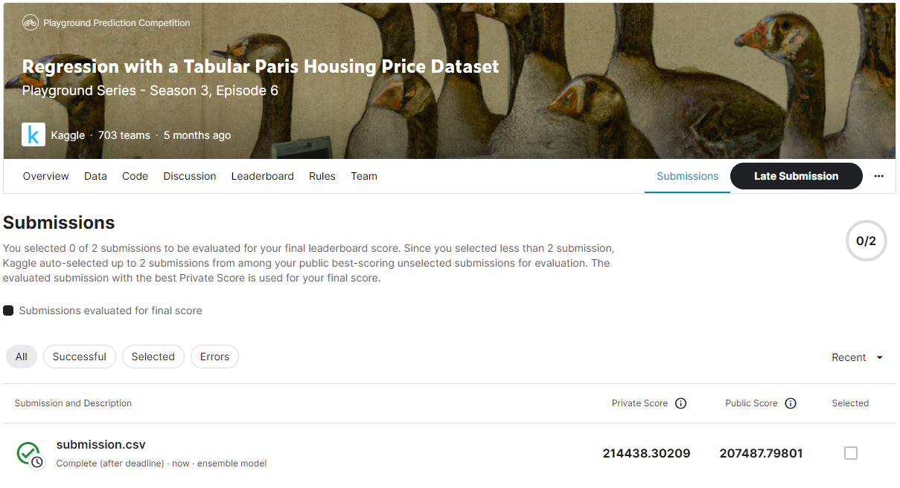
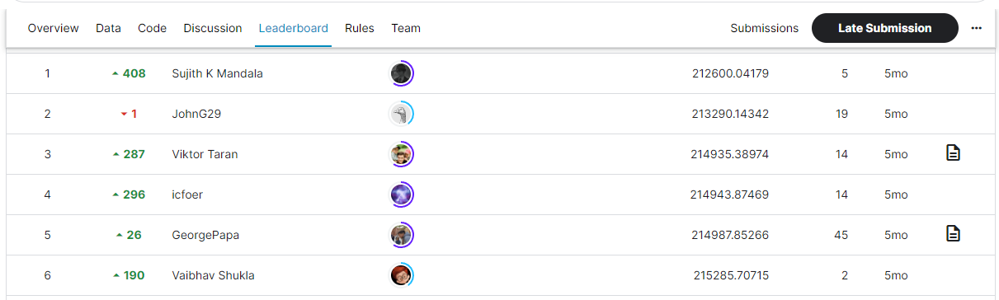

# Regression with a Tabular Paris Housing Price Dataset
## 결과
### 요약 정보
- 도전기관 : SecuLayer
- 도전자 : 김소영
- 최종 스코어 : 214438.30209
- 제출 일자 : 2023-07-07
- 총 참여 팀수 : 703
- 순위 및 비율 : 3(0.4%)

## 결과 화면

## 사용한 방법 & 알고리즘
- Step 1. 데이터 전처리
  - One-Hot Encoder, 이상치 제거, Feature Engineering, StandardScaler
- Step 2. XGBoost, CatBoost, RandomForestRegressor 모델
- Step 3. Stacking: LightGBM

## 코드
- Regression_with_a_Tabular_Paris_Housing_Price_Dataset.ipynb
