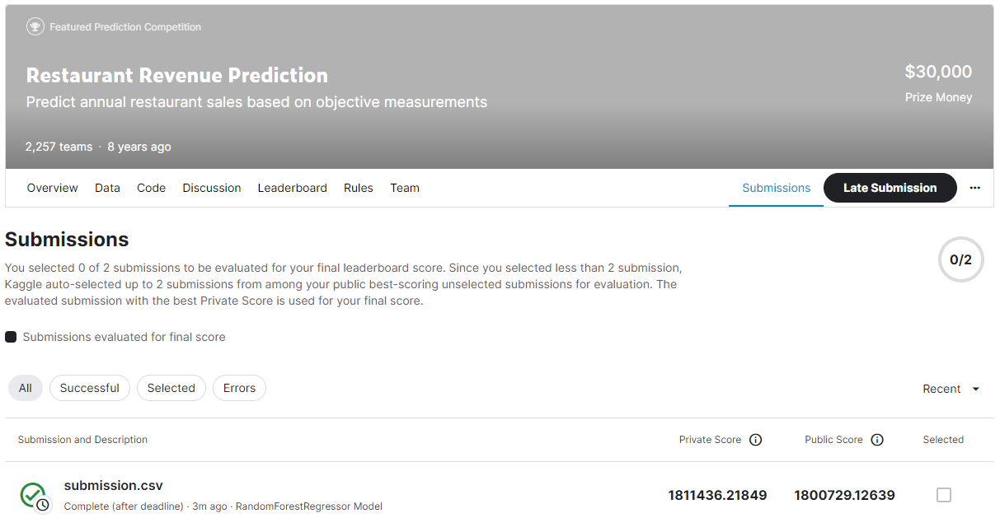
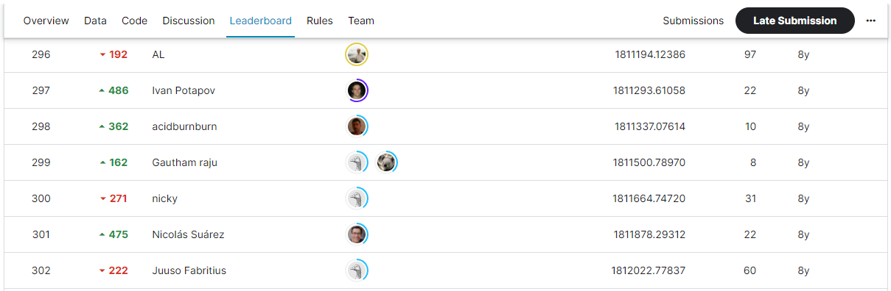

# Restaurant Revenue Prediction
## 결과
### 요약 정보
- 도전기관 : SecuLayer
- 도전자 : 김소영
- 최종 스코어 : 1811436.21849
- 제출 일자 : 2023-07-17
- 총 참여 팀수 : 2,257
- 순위 및 비율 : 299(13.2%)

## 결과 화면

## 사용한 방법 & 알고리즘
- Step 1. 데이터 전처리
  - 이상치 제거, Feature Engineering, 범주형변수(라벨인코딩), Data Scaling(StandardScaler)
- Step 2. RandomForestRegressor 모델

## 코드
- Restaurant_Revenue_Prediction.ipynb