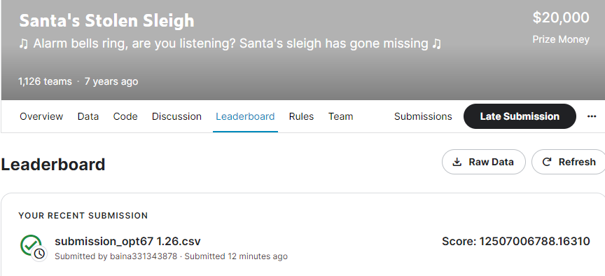
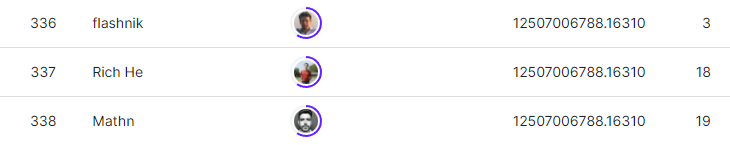

# Santa's Stolen Sleigh
# 결과
---
### 요약 정보
* 도전기관 : 한양대학교
* 도전자 : 백나
* 최종 스코어 : 12507006788.16310
* 제출 일자 : 2023-04-28
* 총 참여 팀수 : 1126
* 순위 및 비율 : 336 (29.84%)

# 결과 화면
---

# 사용한 방법 & 알고리즘
 *haversine 모듈: 두 위도와 경도 사이의 거리를 계산하는 데 사용됩니다.
 *bb_sort 함수에서는 순열 및 조합 알고리즘을 사용하여 최적의 솔루션을 찾습니다.
 *path_opt_test 함수에서 haversine 공식을 사용하여 두 지점 사이의 거리를 계산하고 경로 최적화 알고리즘을 사용하여 최단 경로를 찾아 총 비용을 줄입니다.
# 코드
---
[`./Santa's.ipynb`](./Santa's.ipynb)

# 참고자료
---
data categories(3): 
 https://www.kaggle.com/competitions/santas-stolen-sleigh
 https://download.csdn.net/download/weixin_42138376/20000898?ops_request_misc=%257B%2522request%255Fid%2522%253A%2522168265568116800226533541%2522%252C%2522scm%2522%253A%252220140713.130102334.pc%255Fall.%2522%257D&request_id=168265568116800226533541&biz_id=1&utm_medium=distribute.pc_search_result.none-task-download-2~all~first_rank_ecpm_v1~rank_v31_ecpm-2-20000898-null-null.142^v86^insert_down1,239^v2^insert_chatgpt&utm_term=Santas%20Stolen%20Sleigh&spm=1018.2226.3001.4187.3
