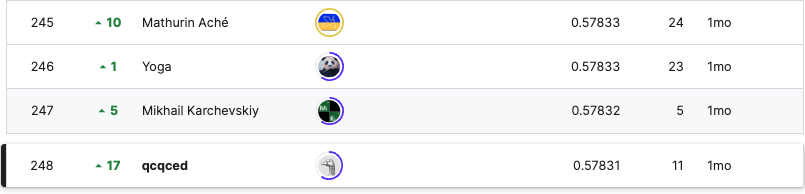

# Stable Diffustion - Image to Prompts

## 요약 정보
* 도전기관 : 시큐레이어
* 도전자 : 이정환
* 최종 스코어 : 0.57831
* 제출 일자 : 2023-05-16
* 총 참여 팀수 : 1231
* 순위 및 비율 : 248 (20.14%)
___
## 결과 화면

___
## 대회 개요
- Stable Diffustion 2.0에서 만들어진 이미지의 실제 프롬프트를 예측하는 것이 목표
___
## 사용한 방법 & 알고리즘
### **[Style Extractor + Metric Learning]**  
**Part 0. Filtering Similar Image by FAISS**
* **Filtering Value: 0.75 (Cosine Similarity)**
    - Dataset:  
        - 1) 2M Image & Prompt from Diffusion DB   
        - 2) 30K Image & Prompt from ChatGPT
        - 3) 90K Image & Prompt from Discussion
        - 4) 30K Image & Prompt from Discussion
    - Semantic Search by FAISS  
        - Threshold: 0.75

**Part 1. Style Extractor**  
* **Analysis Prompts Text**
    - 실제 Prompt Text에 이미지의 배경적 요소를 설명하는 토큰이 상당수 포함되어 있다는 사실을 알 수 있음 (from Open Discussion)
* **Use Backbone to Pure CNN Model**
    - Backbone: convnext_base_384_in22ft1k
    - ONLY Forward Pass, NOT Backward Pass to this part  
    - CLIP의 Backbone인 ViT는 receptive field가 CNN 보다 커서(patch size == 14x14) local information 포착 성능이 상대적으로 떨어짐
    - 프롬프트에 상당수 부분이 배경적 요소라는 점을 감안하면 부족한 local information을 보완해줄 필요가 있음
    - Pure CNN Model을 사용해 ViT의 부족한 local information extract 성능을 보완

**Part 2. Metric Learning: Matching image2prompt**  
* **Training Config**
    - Vision Backbone: openai/clip-vit-large-patch14
    - Text Backbone: sentence-transformers/all-MiniLM-L6-v2 (ONLY Forward, from competition)
    - Pooling: GEMPool (p=2)
    - Loss: Multiple Negative Ranking Loss
        - Normalized scaler Image & Text with sqrt(384)
    - Metrics: Cosine Similarity
    - Apply Freeze & Re-Init Encoders
    - Batch Size: 256  
    - Cross Validation: 5 Fold & Out of Folds

* **Training Detail**
    - Open AI CLIP 구조상 Text Decoder가 없어서 Prompt Text Generate가 불가능한 상항
    - CLIP + Decoder(GPT2) 구조 사용하는 것보다, CLIP의 내장 Text Encoder를 Competition 지정 모델로 변경해 Generate 단계를 생략  
    (CLIP + Decoder 구조를 사용하고 싶다면 대신 BLIP를 사용하는 것이 효율적)
    - Text Backbone을 대회 호스트가 공식적으로 지정해준 모델을 사용. 해당 모델로 예측한 프롬프트의 임베딩을 추출해 코사인 유사도를 계산하기 때문에 훈련 과정에서 동일한 모델을 사용
    - Test 상황에서 Fine-Tuned 되지 않은 Text Backbone 사용하기 때문에 Backward 과정 생략
    - MNRL의 경우 Batch Negatvie Sampling 개념 사용, Batch Size가 클수록 성능 향상에 도움이 되기 때문에 Batch Size을 256으로 설정
    - Style Extractor는 Resource Limit 때문에 학습 시키지 못함, 학습할 경우 성능 개선에 도움이 될 것이라 생각  
___
# 참고자료  
##### https://poloclub.github.io/diffusiondb/  
##### https://www.kaggle.com/competitions/stable-diffusion-image-to-prompts/discussion/402146
##### https://arxiv.org/pdf/2103.00020.pdf
##### https://openai.com/research/clip
##### https://arxiv.org/abs/2112.10752
##### https://github.com/CompVis/stable-diffusion
##### https://github.com/lucidrains/DALLE2-pytorch/issues/60
##### https://github.com/UKPLab/sentence-transformers/blob/master/sentence_transformers/losses/MultipleNegativesRankingLoss.py  
##### https://www.kaggle.com/code/tanreinama/style-extract-from-vgg-clip-object-extract
##### https://arxiv.org/abs/2201.12086
___