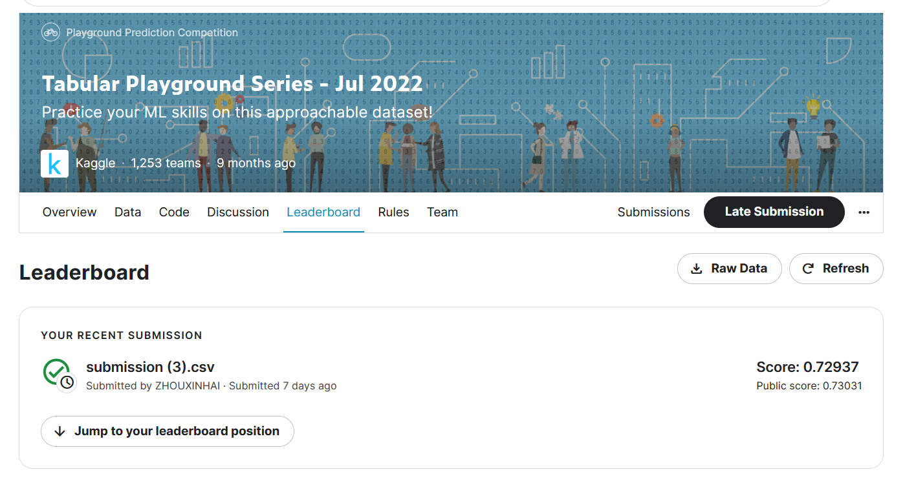

# Tabular Playground Series - Jul 2022

---

# 결과

---

### 요약 정보

* 도전기관 : 한양대학교
* 도전자 : 주흠해
* 최종 스코어 :  0.72937
* 제출 일자 : 2023-04-24
* 총 참여 팀수 : 1253
* 순위 및 비율 : 242(19.8%)

# 결과 화면

# 사용한 방법 & 알고리즘

---

* K-Means+BGMM
* We will be using BGMM package in Python

# 코드

[jul-2022](./tabular-playground-7-2022.ipynb)

# 참고자료

Using idea from: 

[GMM model](https://www.kaggle.com/code/adaubas/tps-jul22-lgbm-extratree-qda-soft-voting)

BGMM model:

