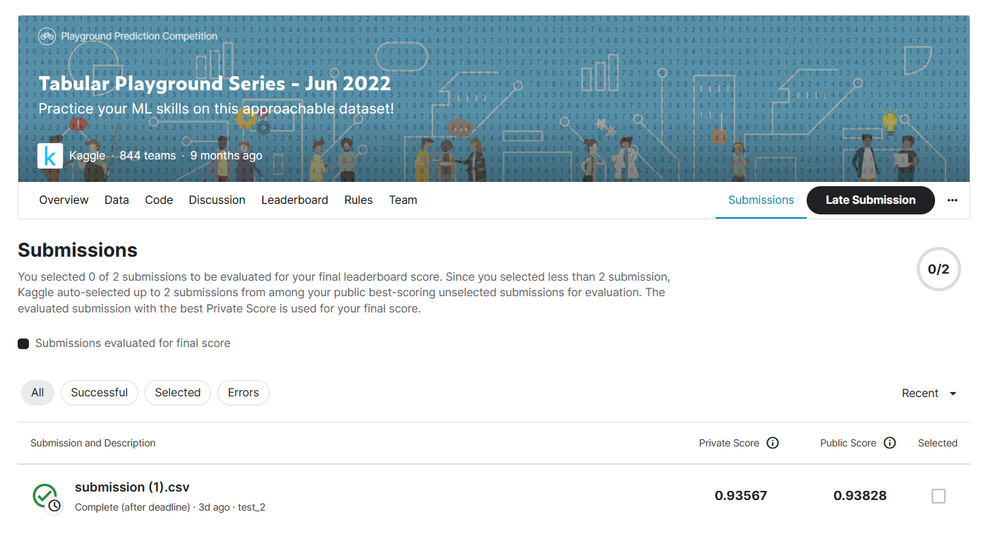

# Tabular Playground Series - Oct 2021

---

# 결과

---

### 요약 정보

* 도전기관 : 한양대학교
* 도전자 : 주흠해
* 최종 스코어 :  0.93567
* 제출 일자 : 2023-04-10
* 총 참여 팀수 : 847
* 순위 및 비율 : 337(39.8%)

# 결과 화면

# 사용한 방법 & 알고리즘

---

* MICE알고리즘 and Linear Regression방법
* we will be using MICE package in R

# 코드

[R](./tabular-playground-6-2022.R)

# 참고자료

MICE here stands for Multivariate imputation for chained equations. More about the package can be accessed herehttps://cran.r-project.org/web/packages/mice/index.html

