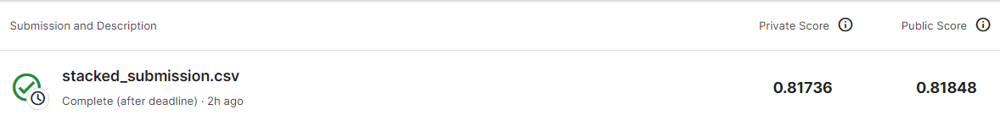
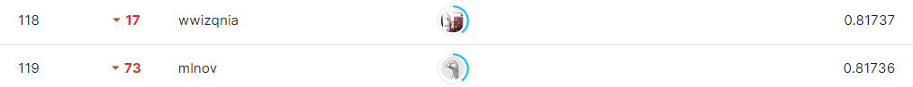

# Tabular Playground Series - Sep 2021
***
# 결과
***
## 요약정보
- 도전기관 : 시큐레이어
- 도전자 : 석민재
- 최종 스코어 : 0.81736
- 제출 일자 : 2023-07-24
- 총 참여 팀수 : 1942
- 순위 및 비율 : 119(6.12%)

# 결과 화면

# 사용한 방법 & 알고리즘
***
- HistGradientBoosting, LightGBM, Catboost, XGBoost Classifier 사용
- StratifiedKFold를 통해 모든 Train Data를 학습에 사용
- Stacking Ensemble을 통해 사용 모델을 통합

# 코드
[Main_Code](./main.ipynb)

# 참고자료
- https://towardsdatascience.com/ensemble-methods-bagging-boosting-and-stacking-c9214a10a205
- https://github.com/lsjsj92/machine_learning_basic
