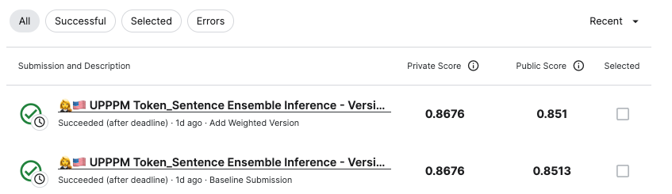

# U.S. Patent Phrase to Phrase Matching

## 요약 정보
* 도전기관 : 시큐레이어
* 도전자 : 이정환
* 최종 스코어 : 0.8676
* 제출 일자 : 2023-04-24
* 총 참여 팀수 : 1889
* 순위 및 비율 : 20 (1.05%)
___
## 결과 화면

___
## 대회 개요
- 특허 및 발명품의 기술서와 USPTO 분류 기준을 명시한 텍스트 데이터 사이의 유사도를 추출, 새로 등록되는 특허 및 발명을 자동으로 분류하는 것을 목적
___
## 사용한 방법 & 알고리즘
### **[Unique Two Pipeline Ensemble]**  
**Pipeline 1. Token-Classification**  
* **Preprocess CPC Context Data**
    - Apply Cleaning
    - Apply Normalization by CounterVectorizer
* **Make Context Embedding**
    - anchor1 + target 1 + target 2.... + target N + context_text   
      (conctex_text = anchor's cpc + target's cpc)
    - Apply various sequence length: 400, 640, 768, 1024
    - Randomly shuffle each anchor's target position in context embedding 
* **Classification:**  
    - Backbone Model: DeBERTa-V3-Large
    - Apply Freeze, Re-Init Transformer Encoder
    - Apply Layer Wise Learning-Rate Decay
    - BCEWithLogitLoss
    - CV Metric: PearsonScore

**Pipeline 2. Sentence-Regression**  
* **Make Context Embedding**  
    - anchor1 + target + context_text   
      (conctex_text = anchor's cpc + target's cpc)
* **Regression:**  
    - Backbone Model: DeBERTa-V3-Large
    - Apply Freeze, Re-Init Transformer Encoder
    - Apply Layer Wise Learning-Rate Decay
    - MSELoss 
    - CV Metric: PearsonScore
___
# 참고자료  
##### https://www.kaggle.com/competitions/us-patent-phrase-to-phrase-matching/overview
##### https://arxiv.org/abs/2103.10385
##### https://aclanthology.org/2021.naacl-main.185.pdf
##### https://aclanthology.org/2021.eacl-main.20.pdf
##### http://dsba.korea.ac.kr/seminar/?mod=document&uid=1829
##### https://www.kaggle.com/competitions/us-patent-phrase-to-phrase-matching/discussion/332492
___