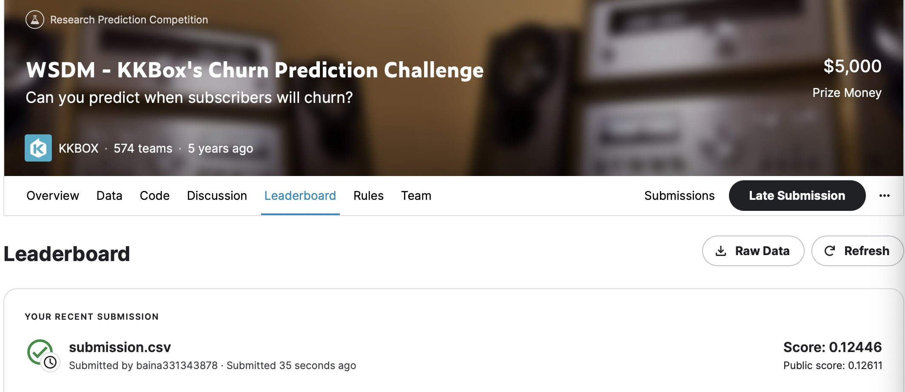
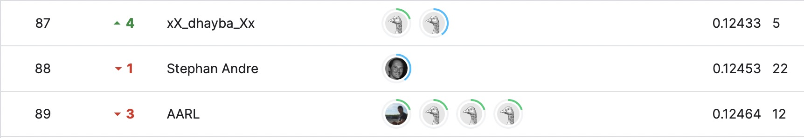

# WSDM - KKBox's Churn Prediction Challenge
# 결과
---
### 요약 정보
* 도전기관 : 한양대학교
* 도전자 : 백나
* 최종 스코어 : 0.12446
* 제출 일자 : 2023-04-18
* 총 참여 팀수 : 574
* 순위 및 비율 : 88 (15.33%)

# 결과 화면
---

# 사용한 방법 & 알고리즘
 *Keras 라이브러리를 사용하여 이탈 예측을 위해 신경망 접근 방식을 사용합니다.
 *ReLU 활성화 함수, L2 정규화, 이진 교차 엔트로피 손실 및 Adadelta 최적화와 같은 방법을 사용하여 모델을 훈련하고 최적화합니다.

# 코드
---
[`./Challenge.ipynb`](./Challenge.ipynb)

# 참고자료
---
data categories(3): 
 https://www.kaggle.com/competitions/kkbox-churn-prediction-challenge/discussion
 
