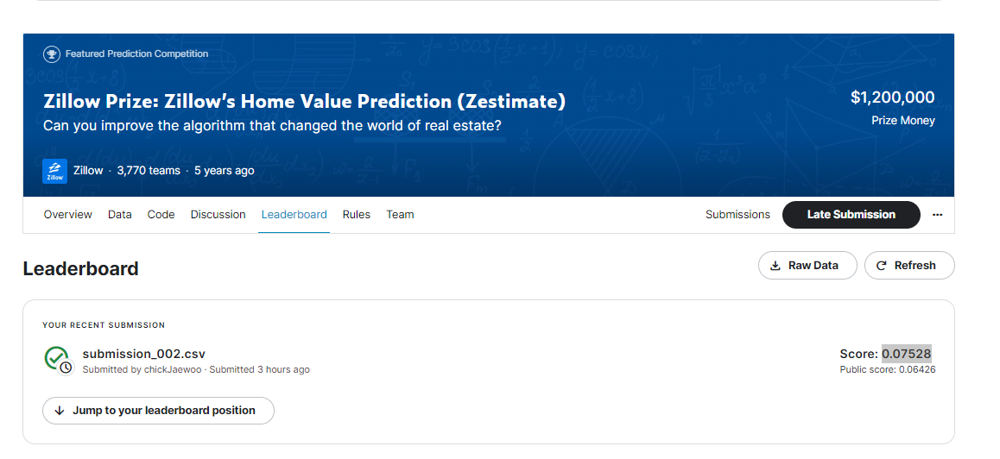
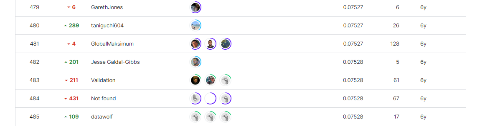

# Zillow Prize Zillow’s Home Value Prediction (Zestimate)
## 결과
---
### 요약정보
◆ 도전기관 : Seculayer   

◆ 도전자 : 박재우   

◆ 최종 스코어 : 0.07528   

◆ 제출일자 : 2023-06-29

◆ 총 참여 팀수 : 3770

◆ 순위 및 비율 : 482(12.79%)

# 결과 화면

# 사용한 방법 & 알고리즘
---
# 코드
[code](code.ipynb)
---
# 참고자료
---
