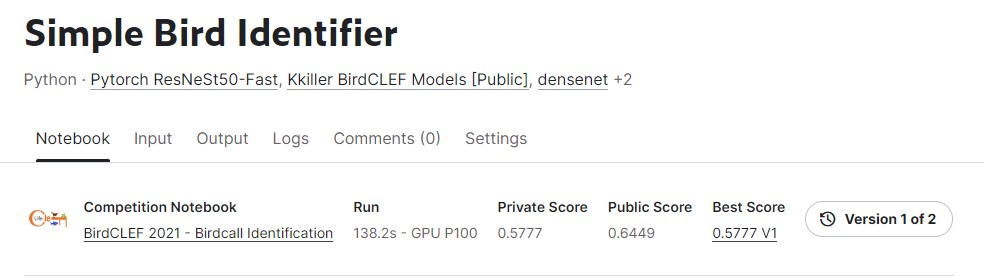

# BirdCLEF 2021 - Birdcall Identification

---
# 결과
---
### 요약 정보
* 도전기관 : 한양대학교
* 도전자 : 권순양
* 최종 스코어 : 0.5777
* 제출 일자 : 2023-07-25
* 총 참여 팀수 : 816
* 순위 및 비율 : 227 (27.81%)

# 결과 화면
---

# 사용한 방법 & 알고리즘
---
* EDA
* Mel spectrogram
* ResneSt50 model
* Audio recognition

# 코드
---
[jupyter notebook code](simple-bird-identifier.ipynb)

## 참고 자료

- [Mel spectrogram](https://medium.com/analytics-vidhya/understanding-the-mel-spectrogram-fca2afa2ce53)

