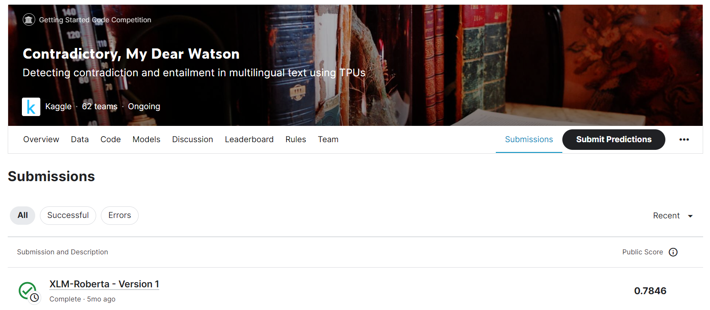

# Contradictory, My Dear Watson

---
# 결과
---
### 요약 정보
* 도전기관 : 한양대학교
* 도전자 : 원일남
* 최종 스코어 : 0.7846
* 제출 일자 : 2023-06-30
* 총 참여 팀수 : 66
* 순위 및 비율 : 24 (36.4%)

# 결과 화면
---

# 사용한 방법 & 알고리즘
---
* XLM-RoBERTa

  

# 코드
---
[jupyter notebook code](xlm-roberta.ipynb)

## 참고 자료

- [NLI with XLM-RoBERTa](https://www.kaggle.com/code/yehoonjoo/nli-with-xlm-roberta)

