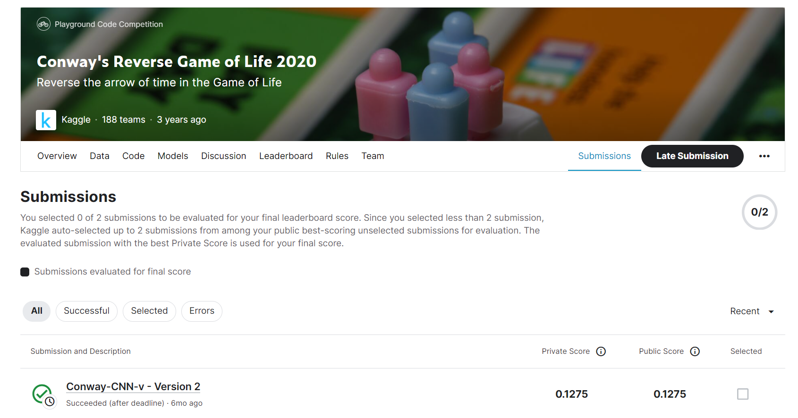

# Conway's Reverse Game of Life 2020

---
# 결과
---
### 요약 정보
* 도전기관 : 한양대학교
* 도전자 : 원일남
* 최종 스코어 : 0.1275
* 제출 일자 : 2023-06-09
* 총 참여 팀수 : 188
* 순위 및 비율 : 73 (38.8%)

# 결과 화면
---

# 사용한 방법 & 알고리즘
---
* CNN model 

  

# 코드
---
[jupyter notebook code](conway-cnn-v.ipynb)

## 참고 자료

- [Iterative CNN Approach](https://www.kaggle.com/code/hasnainajmal281/iterative-cnn-approach)

