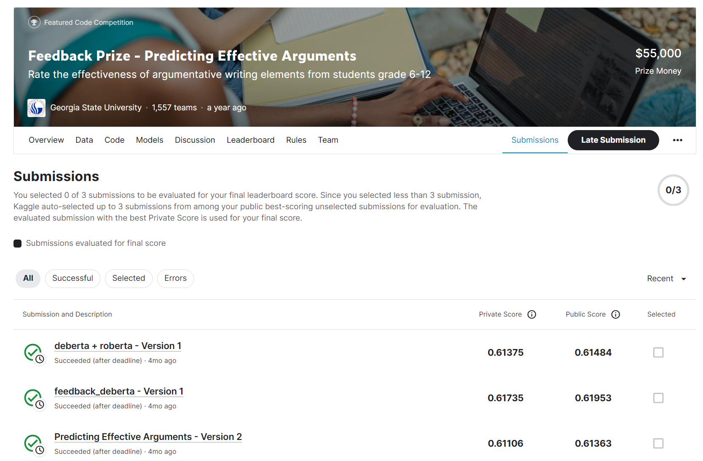

# Feedback Prize - Predicting Effective Arguments

---
# 결과
---
### 요약 정보
* 도전기관 : 한양대학교
* 도전자 : 원일남
* 최종 스코어 : 0.61106
* 제출 일자 : 2023-08-10
* 총 참여 팀수 : 1557
* 순위 및 비율 : 534 (34.3%)

# 결과 화면
---

# 사용한 방법 & 알고리즘
---
* DeBERTa

* RoBERTa

* LGBM

  

# 코드
---
[jupyter notebook code](predicting-effective-arguments.ipynb)

## 참고 자료

- [feedback_deberta_large_LB0.619](https://www.kaggle.com/code/brandonhu0215/feedback-deberta-large-lb0-619)
- [RoBerta-base Inference v2.0](https://www.kaggle.com/code/arvissu/roberta-base-inference-v2-0)

