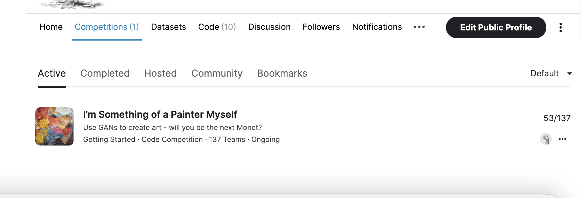

# I’m Something of a Painter Myself

---
# 결과
---
### 요약 정보
* 도전기관 : 한양대학교
* 도전자 : 권순양
* 최종 스코어 : 58.31436
* 제출 일자 : 2023-04-13
* 총 참여 팀수 : 137
* 순위 및 비율 : 55 (38.7%)

# 결과 화면
---

# 사용한 방법 & 알고리즘
---
* TPU 가속
* TFRecord dataset
* Generator
  * downsample
  * Upsample

* Discriminator 
* CycleGAN 모델 사용

# 코드
---
[jupyter notebook code]( [monet1.ipynb](monet1.ipynb) )

## 참고 자료

- [cycleGan](https://www.tensorflow.org/tutorials/generative/cyclegan)

