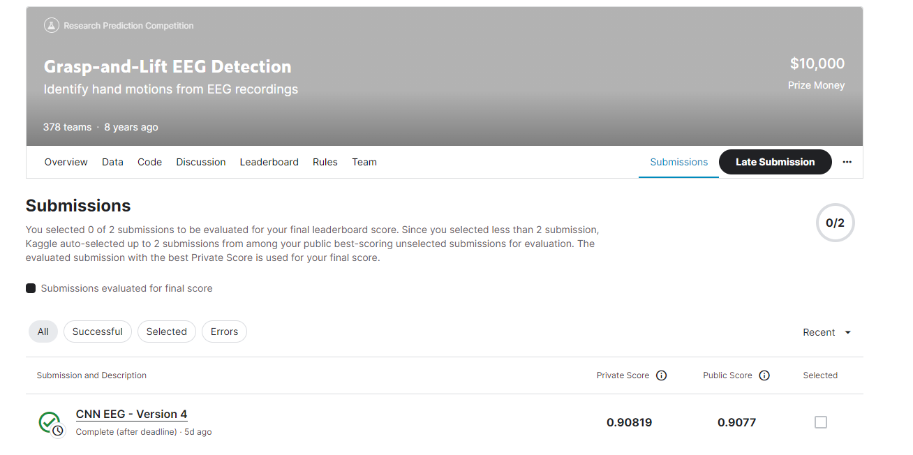
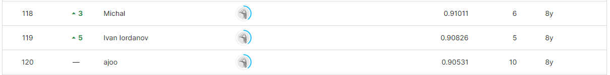

# Grasp-and-Lift EEG Detection

---

# 결과

---

### 요약 정보

* 도전기관 : 시큐레이어
* 도전자 : 김민석
* 최종 스코어 : 0.90819
* 제출 일자 : 2023-06-22
* 총 참여 팀수 : 378
* 순위 및 비율 : 120(31.75%)

# 결과 화면

# 사용한 방법 & 알고리즘

---

* CNN 모델 사용

# 코드

[Player Contact Detection](cnn-eeg.ipynb)

# 참고자료

