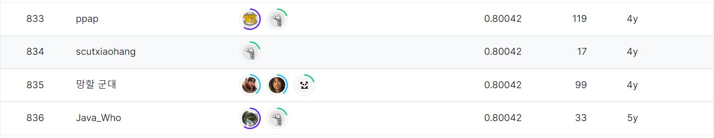

# Home Credit Default Risk
---
# 결과
---
### 요약 정보
* 도전기관 : 시큐레이어
* 도전자 : 박상우
* 최종 스코어 : 0.80042
* 제출 일자 : 2023-02-13
* 총 참여 팀수 : 7180
* 순위 및 비율 : 836 (11.6%)

# 결과 화면
--- 

# 사용한 방법 & 알고리즘
---
* 금융 지식을 바탕으로 심층 EDA 및 Feature Generation 진행
* Pycaret과 Optuna를 사용해 모델링 및 튜닝 

# 코드
---
[python code](main.ipynb)

# 참고자료
---
##### https://www.kaggle.com/competitions/home-credit-default-risk/overview
##### https://homecredit.ph/homepage