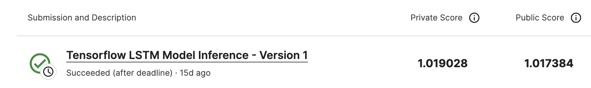

# IceCube - Neutrinos in Deep Ice

---
# 결과
---
### 요약 정보
* 도전기관 : 한양대학교
* 도전자 : 권순양
* 최종 스코어 : 1.019028
* 제출 일자 : 2023-06-30
* 총 참여 팀수 : 812
* 순위 및 비율 : 147 (18.1%)

# 결과 화면
---

# 사용한 방법 & 알고리즘
---
* Angle encoding edges 
* LSTM 모델 사용

# 코드
---
[jupyter notebook code]( [tensorflow-lstm-model-inference.ipynb](tensorflow-lstm-model-inference.ipynb) )

## 참고 자료

- [cycleGan](https://www.tensorflow.org/tutorials/generative/cyclegan)

