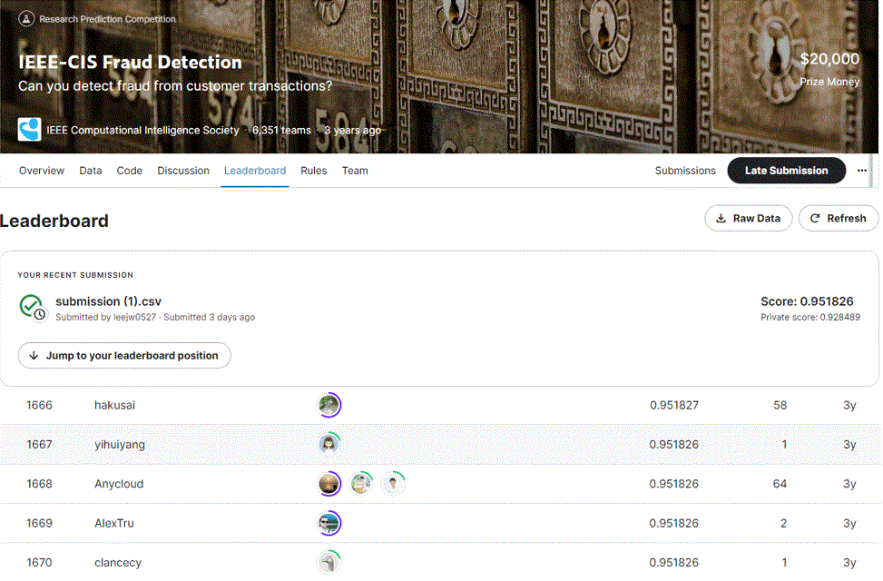

# IEEE-CIS Fraud Detection
---
# 결과
---
### 요약 정보
* 도전기관 : 한양대학교
* 도전자 : 이종원
* 최종 스코어 : 0.951826
* 제출 일자 : 2023-02-13
* 총 참여 팀수 : 6351
* 순위 및 비율 : 1667 (26.20%)

# 결과 화면
---


# 사용한 방법 & 알고리즘
---
* kyakovlev가이전에 작업한 여러가지 cross validation방식을 참고
* catboost model과 GroupKFold를 결합하여 학습
* kyakovlev가 수행하였던 데이터 사용 및 결과물을 합쳐 제출

# 코드
---
[jupyter notebook code_1](ieee-cis-fraud-detection.ipynb)
[jupyter notebook code_2](ieee-catboost-groupkfold-cv.ipynb)

# 참고자료출
---
##### https://www.kaggle.com/code/kyakovlev/ieee-fe-with-some-eda
##### https://www.kaggle.com/code/kyakovlev/ieee-data-minification
##### https://www.kaggle.com/code/kyakovlev/ieee-simple-lgbm
##### https://www.kaggle.com/code/kyakovlev/ieee-cv-options
##### https://www.kaggle.com/code/kyakovlev/ieee-lgbm-with-groupkfold-cv

```python

```
