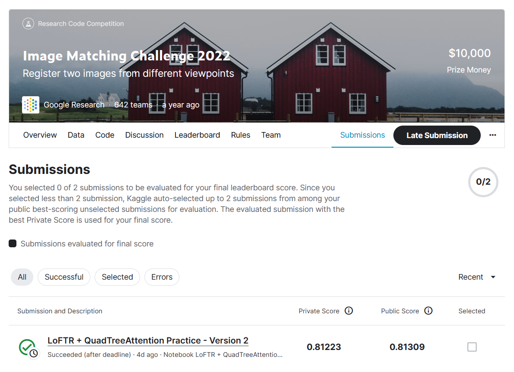
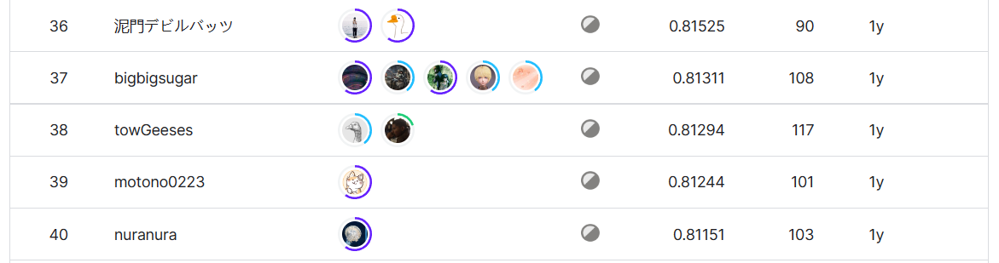

# Image Matching Challenge 2022

## 결과

### 요약정보

+ 도전기관 : 한양대학교
+ 도전자 : 이자호
+ 최종 스코어 :  0.81309
+ 제출 일자 : 2023-06-22
+ 총 참여 팀수 : 643
+ 순위 및 비율 : 38 (5.9%)

## 결과 화면

## 사용한 방법 & 알고리즘

+ 특징 매칭 전후에 모두 이미지를 조정해야 함
+ Pre-trained LoFTR 모델을 사용하여 이미지에서 특징을 매칭
+ 최적화 전략으로 LoFTR 모델의 Self-Attention 및 Cross Attention 대신 QuadTree Attention을 사용

## 코드

[Jupyter Notebook Code Here](./image-matching-challenge-2022.ipynb)

## 참고 자료

LoFTR Paper URL: [LoFTR: Detector-Free Local Feature Matching with Transformers](https://arxiv.org/pdf/2104.00680.pdf)

QuadTree Paper URL: [QUADTREE ATTENTION FOR VISION TRANSFORMERS](https://arxiv.org/pdf/2201.02767.pdf)

