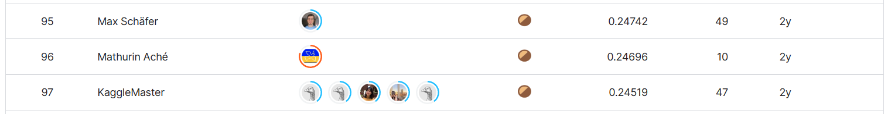

# Google Landmark Recognition 2021

## 결과

### 요약정보

+ 도전기관 : 한양대학교
+ 도전자 : 이자호
+ 최종 스코어 :  0.24587
+ 제출 일자 : 2023-06-01
+ 총 참여 팀수 : 383
+ 순위 및 비율 : 96 (25.1%)

## 결과 화면

## 사용한 방법 & 알고리즘

+ Pre-trained ResNet-34 모델을 사용하여 이미지에서 특징을 추출
+ 테스트 세트 이미지와 훈련 세트 전체의 코사인 유사도를 비교하여 테스트 세트에 이웃을 할당
+ KNN 방식으로 이웃을 기반으로 각 테스트 세트 이미지에 landmark ID를 할당
+ Non-landmark 이미지가 테스트 세트 이미지에 영향을 주는 것을 억제하기 위해 패널티 메커니즘을 사용

## 코드

[Jupyter Notebook Code Here](./landmark-recognition-2021.ipynb)

## 참고 자료

Paper URL: [Supporting large-scale image recognition with out-of-domain samples](https://arxiv.org/pdf/2010.01650.pdf)

