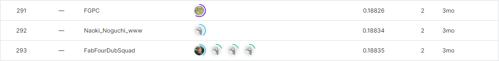
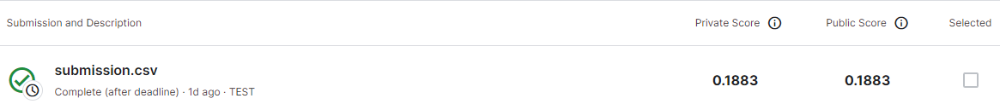

# march-machine-learning-mania-2023

---

# 결과

---

### 요약 정보

* 도전자 : 이준영
* 최종 스코어 :  0.18830
* 제출 일자 : 2023-06-22
* 총 참여 팀수 : 1033
* 순위 및 비율 : 292(28.27%)

# 결과 화면

# 사용한 방법 & 알고리즘

---

* 

# 코드

[march-machine-learning-mania-2023](./ncaa-march-madness-sabermetric-spin-v2.ipynb)