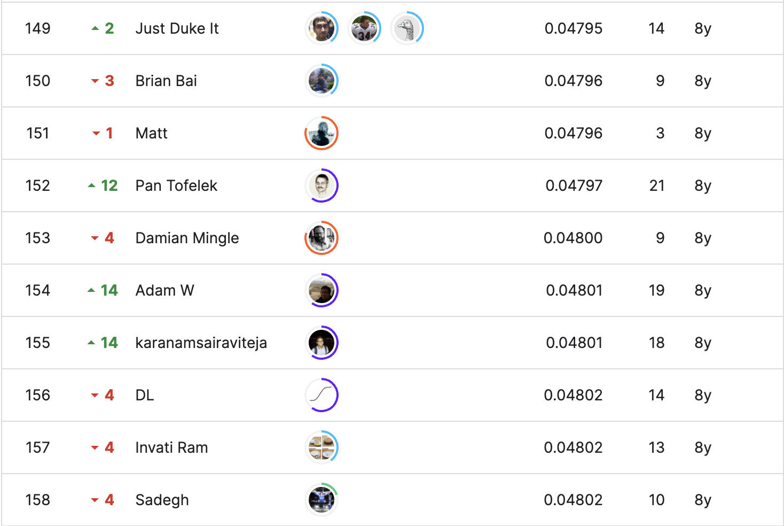
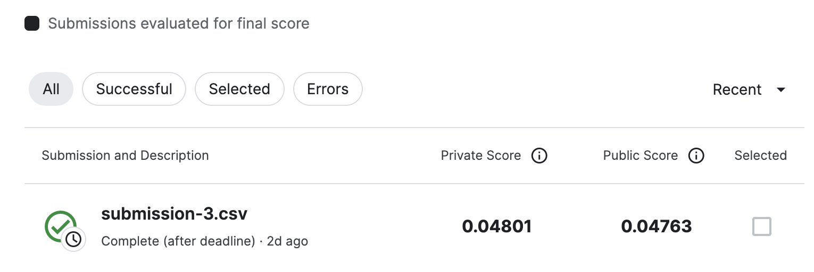

# Open Problems - Multimodal Single-Cell Integration

## 결과

### 요약정보

- 도전기관: 한양대학교
- 도전자: 장송밍
- 최종스코어: 0.76686
- 제출일자: 2023-05-25
- 총 참여 팀 수:234
- 순위 및 비율: 1220(19.18%)

### 결과화면

## 사용한 방법 & 알고리즘

CatBoostRegressor

## 코드

[Open Problems - Multimodal Single-Cell Integration](./open-problems-multimodal.ipynb)

## 참고 자료

- [MSCI EDA which makes sense](https://www.kaggle.com/code/ambrosm/msci-eda-which-makes-sense)
- [\[LB:0.811\]Normalized Ensembles for Pearson's r](https://www.kaggle.com/code/vslaykovsky/lb-0-811-normalized-ensembles-for-pearson-s-r)

