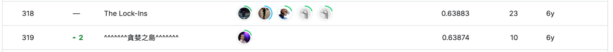

# Outbrain Click Prediction

## 결과

### 요약정보

- 도전기관: 한양대학교
- 도전자: 장송밍
- 최종스코어: 0.63880
- 제출일자: 2023-04-19
- 총 참여 팀 수:978
- 순위 및 비율: 319(32.62%)

### 결과화면

## 사용한 방법 & 알고리즘

Random Forest

## 코드

[Outbrain Click Prediction](./outbrain-click-prediction.py)

## 참고 자료

- [Outbrain EDA](https://www.kaggle.com/code/anokas/outbrain-eda)
- [Explore user base by GEO](https://www.kaggle.com/code/andreyg/explore-user-base-by-geo)

