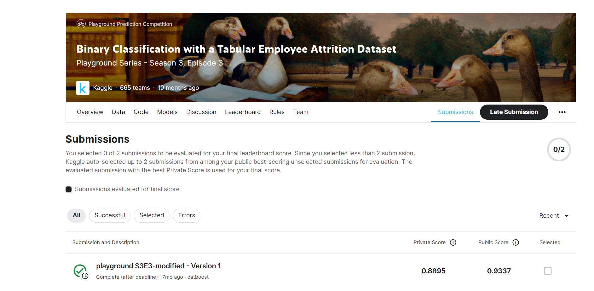

# Binary Classification with a Tabular Employee Attrition Dataset

---
# 결과
---
### 요약 정보
* 도전기관 : 한양대학교
* 도전자 : 원일남
* 최종 스코어 : 0.8895
* 제출 일자 : 2023-05-18
* 총 참여 팀수 : 665
* 순위 및 비율 : 198 (29.8%)

# 결과 화면
---

# 사용한 방법 & 알고리즘
---
* CatBoost

  

# 코드
---
[jupyter notebook code](playground-s3e3-modified.ipynb)

## 참고 자료

- [PS S03E03 📈📊 EDA + Training](https://www.kaggle.com/code/tharunnayak14/ps-s03e03-eda-training)

