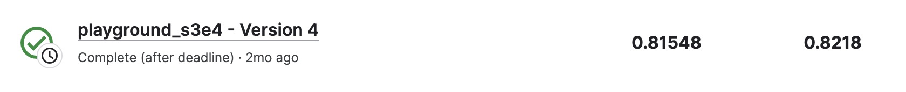

# Binary Classification with a Tabular Credit Card Fraud Dataset

---
# 결과
---
### 요약 정보
* 도전기관 : 한양대학교
* 도전자 : 권순양
* 최종 스코어 : 0.81548
* 제출 일자 : 2023-05-04
* 총 참여 팀수 : 641
* 순위 및 비율 : 156 (24.3%)

# 결과 화면
---

# 사용한 방법 & 알고리즘
---
* EDA
* LGBM Classifier
* Catboost Classifier
* XGBoost Classifier

# 코드
---
[jupyter notebook code]( [playground-s3e4.ipynb](playground-s3e4.ipynb) )

## 참고 자료

- [ref](https://catboost.ai/en/docs/concepts/python-reference_catboostclassifier)

