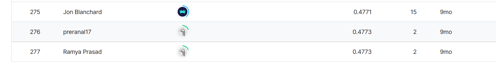

# RSNA 2022 Cervical Spine Fracture Detection

## 결과

### 요약정보

+ 도전기관 : 한양대학교
+ 도전자 : 이자호
+ 최종 스코어 :  0.4773
+ 제출 일자 : 2023-07-19
+ 총 참여 팀수 : 884
+ 순위 및 비율 : 276  (31.2%)

## 결과 화면

## 사용한 방법 & 알고리즘

+ Pydicom 라이브러리를 사용하여 의학 전용 이미지 처리를 수행하고 PyTorch에서 요구하는 형식으로 변환
+ 사전 훈련된 EfficientNetV2 모델을 이용하고 Transfer Learning 수행
+ ㅆK-Fold를 사용하여 모델 앙상블 효과를 달성하여 모델의 일반화 능력 높이기

## 코드

[Jupyter Notebook Code Here](./train and inference-pytorch-effnetv2.ipynb)

## 참고 자료

[🦴 RSNA Fracture Detection - in-depth EDA | Kaggle](https://www.kaggle.com/code/samuelcortinhas/rsna-fracture-detection-in-depth-eda/notebook)

[[train\] PyTorch-EffNetV2 baseline CV:0.49 | Kaggle](https://www.kaggle.com/code/vslaykovsky/train-pytorch-effnetv2-baseline-cv-0-49)

