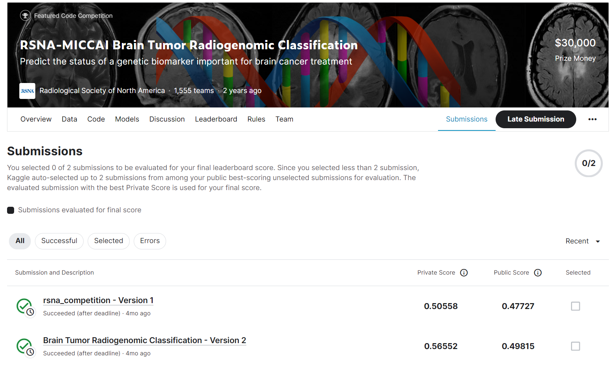

# RSNA-MICCAI Brain Tumor Radiogenomic Classification

---
# 결과
---
### 요약 정보
* 도전기관 : 한양대학교
* 도전자 : 원일남
* 최종 스코어 : 0.56552
* 제출 일자 : 2023-07-24
* 총 참여 팀수 : 1555
* 순위 및 비율 : 227 (14.60%)

# 결과 화면
---

# 사용한 방법 & 알고리즘
---
* ResNet-50

  

# 코드
---
[jupyter notebook code](brain-tumor-radiogenomic-classification.ipynb)

## 참고 자료

- [Brain Tumor Radiogenomic Classification](https://www.kaggle.com/code/hamza3e/brain-tumor-radiogenomic-classification)

