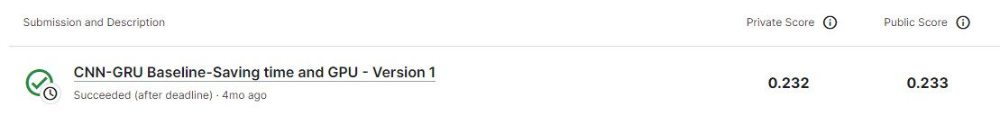

# RSNA STR Pulmonary Embolism Detection

---
# 결과
---
### 요약 정보
* 도전기관 : 한양대학교
* 도전자 : 권순양
* 최종 스코어 : 0.232
* 제출 일자 : 2023-08-10
* 총 참여 팀수 : 784
* 순위 및 비율 : 123 (15.69%)

# 결과 화면
---

# 사용한 방법 & 알고리즘
---
* RSNADataset3D
* MONAI
* EfficientNet 

# 코드
---
[jupyter notebook code](cnn-gru-baseline-saving-time-and-gpu.ipynb)

## 참고 자료

- [EfficientNet](https://arxiv.org/abs/1905.11946)

