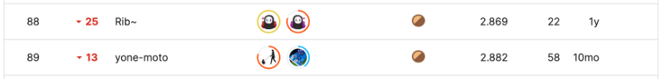
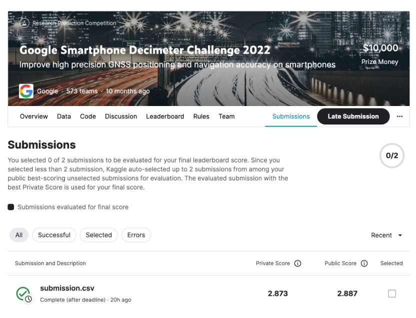

# Google Smartphone Decimeter Challenge 2022

## 결과

### 요약정보

- 도전기관: 한양대학교
- 도전자: 장송밍
- 최종스코어: 2.87300
- 제출일자: 2023-06-09
- 총 참여 팀 수:573
- 순위 및 비율: 89(15.53%)

### 결과화면

## 사용한 방법 & 알고리즘

- Kalman Smoother
- weighted-least-square

## 코드

[Google Smartphone Decimeter Challenge 2022](./smartphone-decimeter-2022.ipynb)

## 참고 자료

- [Carrier Smoothing + Robust WLS + Kalman Smoother](https://www.kaggle.com/code/taroz1461/carrier-smoothing-robust-wls-kalman-smoother)
- [Deriving baseline WLS positions (in progress)](https://www.kaggle.com/code/junkoda/deriving-baseline-wls-positions-in-progress)
- [GSDC2 - baseline submission](https://www.kaggle.com/code/saitodevel01/gsdc2-baseline-submission)

