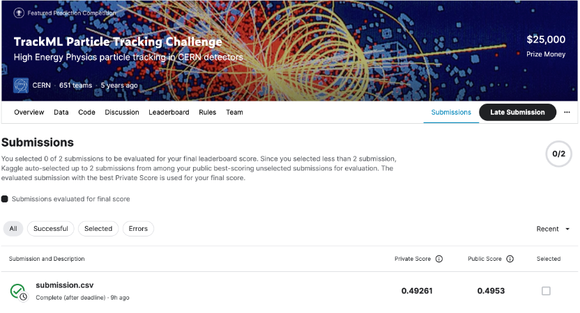

# Google Smartphone Decimeter Challenge 2022

## 결과

### 요약정보

- 도전기관: 한양대학교
- 도전자: 장송밍
- 최종스코어: 0.49261
- 제출일자: 2023-08-06
- 총 참여 팀 수:651
- 순위 및 비율: 162(24.88%)

### 결과화면

## 사용한 방법 & 알고리즘

- Bayesian Optimization

## 코드

[TrackML Particle Tracking Challenge](./trackml-particle-identification.R)

## 참고 자료

- [CTrackML Problem Explanation and Data Exploration](https://www.kaggle.com/code/wesamelshamy/trackml-problem-explanation-and-data-exploration)
- [mod DBSCAN x 100 (parallel)](https://www.kaggle.com/code/sionek/mod-dbscan-x-100-parallel)

