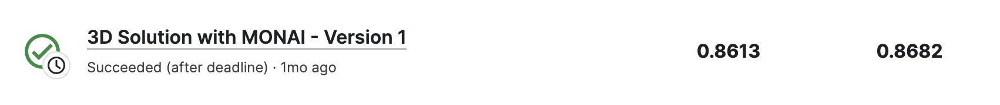

# UW-Madison GI Tract Image Segmentation

---
# 결과
---
### 요약 정보
* 도전기관 : 한양대학교
* 도전자 : 권순양
* 최종 스코어 : 0.86130
* 제출 일자 : 2023-06-9
* 총 참여 팀수 : 1548
* 순위 및 비율 : 529 (34.17%)

# 결과 화면
---

# 사용한 방법 & 알고리즘
---
* 3D 가속
* UNet 모델 사용

# 코드
---
[jupyter notebook code]( [3d-solution-with-monai.ipynb](3d-solution-with-monai.ipynb) )

## 참고 자료

- [ref](https://www.kaggle.com/stainsby/fast-tested-rle)
- [meta](https://www.kaggle.com/code/awsaf49/uwmgi-2-5d-infer-pytorch)

