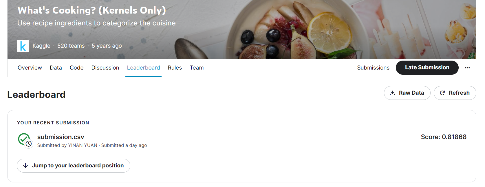

# What's Cooking? (Kernels Only)

---
# 결과
---
### 요약 정보
* 도전기관 : 한양대학교
* 도전자 : YUAN YINAN
* 최종 스코어 : 0.81868
* 제출 일자 : 2023-04-23
* 총 참여 팀수 : 520
* 순위 및 비율 : 165 (31.73%)

# 결과 화면
---

# 사용한 방법 & 알고리즘
* Data Preprocessing
  * LabelEncoder
  * TfidfVectorizer
* Support Vector Machines model
* OneVsRestClassifier

# 코드
---
[jupyter notebook code](what-s-cooking.ipynb)

# 참고 자료

[TF-IDF with OvR SVM : What's Cooking](https://www.kaggle.com/code/shivamb/tf-idf-with-ovr-svm-what-s-cooking)
