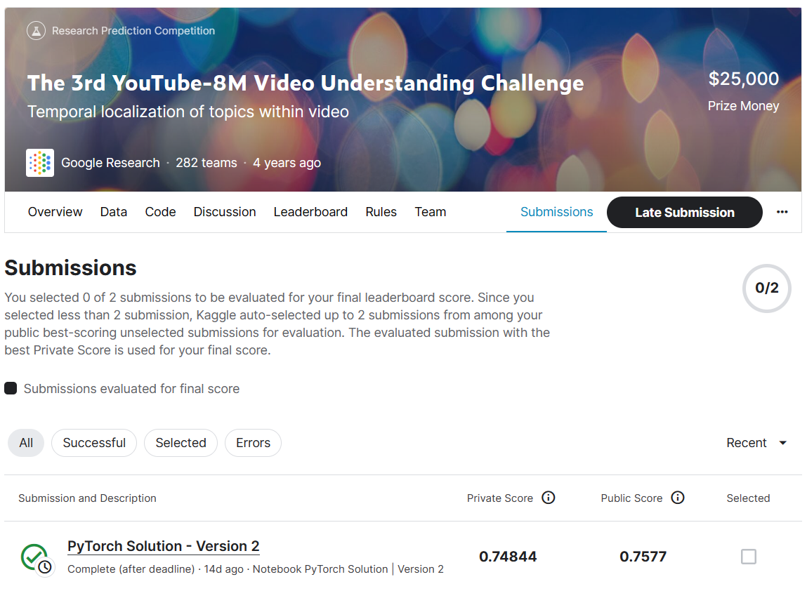
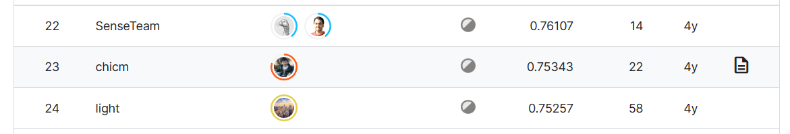

# The 3rd YouTube-8M Video Understanding Challenge

## 결과

### 요약정보

+ 도전기관 : 한양대학교
+ 도전자 : 이자호
+ 최종 스코어 :  0.7577
+ 제출 일자 : 2023-07-07
+ 총 참여 팀수 : 284
+ 순위 및 비율 : 23 (8.1%)

## 결과 화면

## 사용한 방법 & 알고리즘

+ 단순한 모델을 정의하고 복잡성 줄이기
+ 전체 훈련 세트를 사용하지 않고, TFRecord 파일에 저장된 정보를 NumPy 배열 형태로 변환하여 처리함
+ K-Fold를 사용하여 모델 앙상블 효과를 달성하여 모델의 일반화 능력 높이기

## 코드

[Jupyter Notebook Code Here](./youtube8m-2019.ipynb)

## 참고 자료

[The 3rd YouTube-8M Video Understanding Challenge | Kaggle](https://www.kaggle.com/c/youtube8m-2019/discussion/112388)

