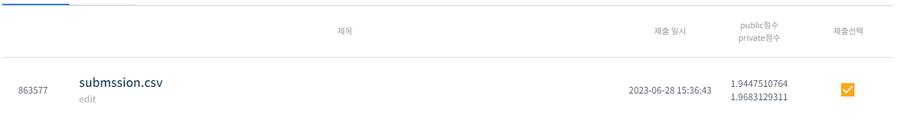
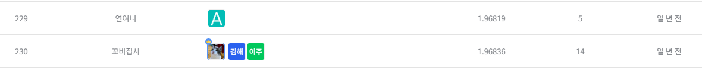

# 자율주행 센서의 안테나 성능 예측 AI 경진대회
-----------------------------------
# 결과
-----------------------------------
### 요약 정보
  * 도전기관 : SecuLayer
  * 도전자 : 윤민식
  * 최종 스코어 : 1.96831
  * 제출 일자 : 2023-06-28
  * 총 참여 팀수 : 1971
  * 순위 및 비율 : 230 (11.6%)
# 결과 화면
-----------------------------------

# 사용한 방법 & 알고리즘
----------------------------------
  * 불필요한 행 정리
  * Optuna 사용해 하이퍼파라미터 튜닝
  * LGBMRegressor 사용해 학습
  * 코랩 성능 문제로 많은 튜닝을 거치지 못함
# 코드
----------------------------------
[자율주행 센서의 안테나 성능 예측 AI 경진대회.ipynb](./자율주행_센서의_안테나_성능_예측_AI_경진대회.ipynb)
# 참고자료
----------------------------------
